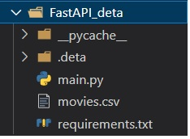
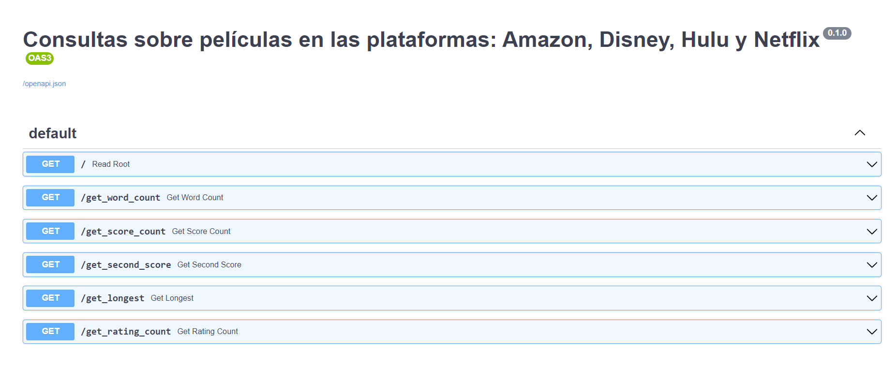

<h1 align="center"> ETL+FastAPI+Deta en Python- Data engineering </h1>

   
   

   
# Tabla de contenidos
* [Introducción](#Introducción)

* [Decripción del proyecto](#Descripción-del-proyecto)

* [Desarrollo del proyecto](#Desarrollo-del-proyecto)

* [Link deployment](#Link-deployment)

* [Link video demostrativo](#Link-video-demostrativo)

* [Principales tecnologías utilizadas](#Principales-tecnologías-utilizadas)

* [Información del proyecto](#Información-del-proyecto)

* [Conclusiones](#Conclusiones)

## Introducción
Hola, mi nombre es Camilo Pedreros :wave: y hoy quiero compartirles mi primer proyecto
en la ciencia de datos. Este proyecto se enfoca al área de data engineering con el objetivo de realizar un proceso de ETL para después disponibilizar los datos en la web para futuras consultas.

## Descripción del proyecto
Como parte del equipo de data de una empresa, el área de análisis de datos solicita al área de Data Engineering (nosotros) ciertos requerimientos para el óptimo desarrollo de sus actividades.
Se nos pide realizar  las transformaciones requeridas a los datasets dados que contienen información sobre películas de distintas plataformas y después disponibilizar los datos mediante la elaboración y ejecución de una API.

## Desarrollo del proyecto

*  EDA \
Primero cargamos los datos usando la libreria pandas, y realizamos las siguientes solo las  transformaciones solicitadas, las cuales son:
    + Generar campo id: Cada id se compondrá de la primera letra del nombre de la plataforma, seguido del show_id ya presente en los datasets 
    + Los valores nulos del campo rating deberán reemplazarse por el string “G” (corresponde al maturity rating: “general for all audiences”
    + Las fechas deberán tener el formato AAAA-mm-dd
    + Los campos de texto deberán estar en minúsculas, sin excepciones
    + El campo duration debe convertirse en dos campos: duration_int y duration_type. El primero será un integer y el segundo un string indicando la unidad de medición de duración: min (minutos) o season (temporadas).
Finalmente se concatenan los 4 dataframes para poder hacer las consultas sobre uno solo y se exporta en formato csv con el nombre 'movies.csv'
* Desarrollo API \
Después de tener los datos limpios, y observando el requerimiento del cliente nos enfocamos en implementar el desarrollo del framework FastAPI, en la cual se requieren las siguientes consultas.
    + Cantidad de veces que aparece una keyword en el título de peliculas/series, por plataforma
    + Cantidad de películas por plataforma con un puntaje mayor a XX en determinado año
    + La segunda película con mayor score para una plataforma determinada, según el orden alfabético de los títulos
    + Película que más duró según año, plataforma y tipo de duración
    + Cantidad de series y películas por rating
* Deployment on Deta \
Dentro del directorio creamos la carpeta FastAPI_deta en la cual deberemos tener el archivo 'main.py', 'requirements.txt' y el archivo 'movies.csv'.

  

Finalmente para hacer el deployment en deta primero creamos una nueva cuenta en https://web.deta.sh/, luego ingresamos a la terminal y navegamos hasta el directorio del proyecto y ejecutamos los siguientes comandos:

* `iwr https://get.deta.dev/cli.ps1 -useb | iex` (instalar deta CLI para usar deta localmente)
* `deta --help` (para verficar la correcta instalacion)
* `deta --login` (para iniciar sesión en Deta desde la CLI)
* `deta new` (para crear un nuevo micro)
* `deta visor enable` (para habilitar el visor)
* `deta auth enable` (para habilitar el auth path)

Corriendo los comandos anteriores en su orden tenemos un deployment éxitoso.

  

## Link deployment 
https://tvfldy.deta.dev/docs#/

## Link video demostrativo 
https://www.youtube.com/watch?v=LLAnmU8L0rU

## Principales tecnologías utilizadas

* Python
    + pandas
    + fastapi
* Deta

## Información del proyecto
Puede encontrar toda la información inicial de este proyecto en: https://github.com/HX-FNegrete/PI01-Data-Engineering
## Conclusiones

Este primer proyecto me gustó mucho ya que aparte del clasico ETL que se conoce en el área de data engineering, se hizo el desarrollo y ejecucion de una API en la web para así poder hacer consultas a los datos sin necesidad de escribir nada de código, lo cual es muy valioso para el área de data analytics ya que se pueden enfocar a encontrar directamente a encontrar insights valiosos para la empresa.

Gracias por haber llegado hasta aquí 💛.

Les dejo mi LinkedIn https://www.linkedin.com/in/camilo-pedreros-106a1a245/ ¿Conectamos? 😉
